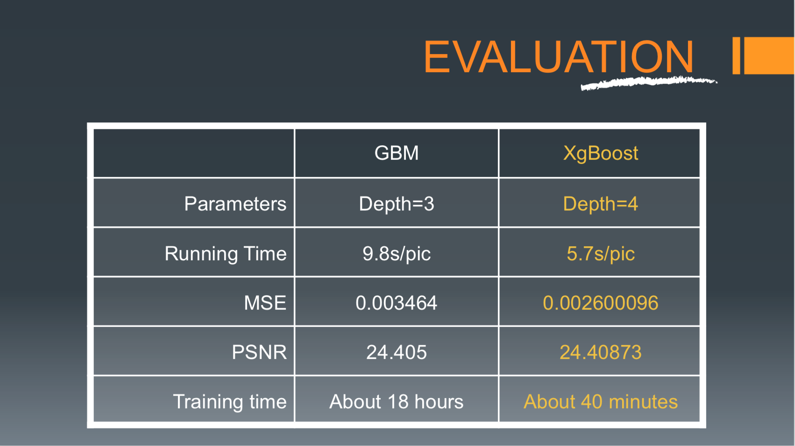

# Project: Can you unscramble a blurry image? 


### [Full Project Description](doc/project3_desc.md)

Term: Spring 2019

+ Team # 4
+ Team members
	+ Shiwei Hua
	+ Charlie Chen
	+ Jingyue Li
	+ Xuewei Li
	+ Shaofu Wang

+ Project summary: In this project, we created a classification engine for enhance the resolution of images. We implemented a baseline Gradient Boosting Model and some of the improvements such as XGBoost, Random Forest, Bayes Tree and Convolutional Neural Network (CNN). Finally, we choose XGBoost with parameters (Depth = 4, Nthread = 2, eta = 0.5, silent=1) as our final model

+ Feature extracted: Feature is the piece of information that describes a part of image or whole image. It is a form of dimensionality reduction. Here we sample 1000 pixels from each LR image. Then we extract 8 pixels around and 4 corresponding pixels to each sampled pixel in HR image. Thus we generate total 1500\*1000\*8 features from each color (RGB) in our 1500 LR images and 1500\*1000\*4 features from each color our 1500 HR images. 

+ Model used:

1.  Baseline: GBM(depth = 3, ntree = 200); MSE = 0.003464; PSNR = 24.405.
2.  Improvement: XGBoost(Depth = 4, Nthread = 2, eta = 0.5, silent=1); MSE = 0.002600096; PSNR = 24.40873.
3.  Other try: Random Forest and CNN

+ Evaluation on
1.  Computational Efficiency - Running time on feature extraction and model training
2.  Computational Efficiency - Running time on test data 
3.  Predictive Power - Error rate (PSNR)


	
**Contribution statement**: (doc/a_note_on_contributions.md) All team members contributed in all stages of this project. All team members approve our work presented in this GitHub repository including this contributions statement. 

1. Shiwei Hua:Developed the feature and Random Forest, Compared the results for each model. Edit Readme and Prepared for Presentation.
2. Xuewei Li: Developed the feature, tried CNN model, improved Xgboost model, tested results for each model, and Edit Google Form.
3. Charlie Chen: Improved the Feature; Developed super-resolution and Gradient Boosting Machine.
4. Jingyue Li: Studied and tried Bayes Tree model.
5. Shaofu Wang: Provided and interpreted of Xgboost model.

(Names listed in no particular order)

Following [suggestions](http://nicercode.github.io/blog/2013-04-05-projects/) by [RICH FITZJOHN](http://nicercode.github.io/about/#Team) (@richfitz). This folder is orgarnized as follows.

```
proj/
├── lib/
├── data/
├── doc/
├── figs/
└── output/
```

Please see each subfolder for a README file.
